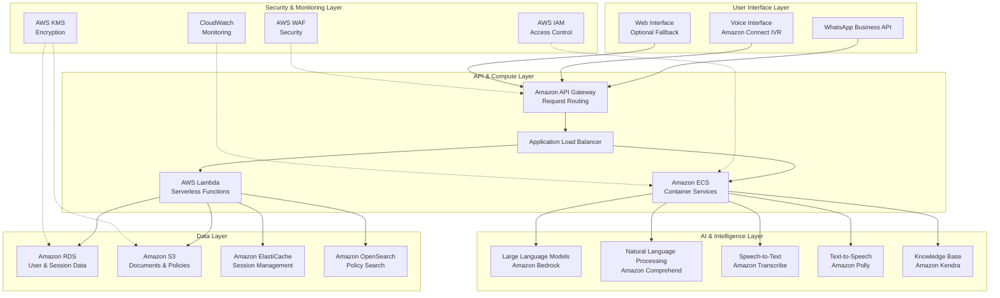

# Design Document: ClearClaim AI

## Overview

ClearClaim AI is a voice-first, multi-channel AI assistant that helps citizens understand and resolve issues with pensions, insurance claims, and government benefits. The system leverages large language models (LLMs) for AI reasoning and grounds its responses in official government policy documents to ensure accuracy and compliance.

The architecture is built on AWS-managed services to ensure scalability, reliability, and security. The system prioritizes accessibility for elderly users and those with low digital literacy through intuitive voice and WhatsApp interfaces, local language support, and clear, step-by-step guidance grounded in official government procedures.

## Architecture

### High-Level Architecture Overview

The ClearClaim AI system is structured in five distinct layers, each built on AWS-managed services to ensure scalability, security, and maintainability:

### Architectural Constraints

**AWS-Managed Services:** All infrastructure components utilize AWS-managed services to minimize operational overhead and ensure enterprise-grade reliability, security, and scalability.

**Voice-First Design:** The system prioritizes voice interaction as the primary interface, with WhatsApp as a secondary channel, ensuring accessibility for users with limited digital literacy.

**LLM-Powered AI Reasoning:** Core intelligence is provided by large language models accessed through Amazon Bedrock, enabling sophisticated natural language understanding and response generation.

**Policy Grounding:** All guidance and explanations are grounded in official government documents stored and indexed in the system, ensuring accuracy and compliance with current regulations.

## Major System Components

### User Interface Layer

**WhatsApp Business API Integration**
- Handles text and voice messages from citizens
- Manages conversation threading and message history
- Supports document sharing and media uploads
- Provides fallback options when other channels fail

**Amazon Connect Voice Interface**
- Processes incoming voice calls through IVR system
- Supports direct microphone input for web-based interactions
- Handles call routing and queue management
- Integrates with Amazon Transcribe for real-time speech processing

**Web Interface (Optional Fallback)**
- Provides browser-based access for users who cannot use voice or WhatsApp
- Offers text-based chat interface with accessibility features
- Serves as backup channel during service disruptions

### API & Compute Layer

**Amazon API Gateway**
- Routes requests from different user interfaces
- Handles authentication and rate limiting
- Manages API versioning and documentation
- Provides request/response transformation

**Application Load Balancer**
- Distributes traffic across compute resources
- Performs health checks and automatic failover
- Handles SSL termination and security policies

**Amazon ECS (Elastic Container Service)**
- Hosts core application services in containers
- Manages conversation orchestration and business logic
- Handles integration between AI services and data layer
- Provides auto-scaling based on demand

**AWS Lambda Functions**
- Processes lightweight, event-driven tasks
- Handles webhook processing from WhatsApp
- Manages document upload and processing
- Executes data cleanup and maintenance tasks

### AI & Intelligence Layer

**Amazon Bedrock (Large Language Models)**
- Provides core AI reasoning capabilities
- Processes natural language queries and generates responses
- Adapts responses based on user context and accessibility needs
- Ensures responses are grounded in official policy documents

**Amazon Comprehend**
- Performs sentiment analysis and entity extraction
- Identifies benefit types and issue categories
- Detects language and emotional state of users
- Supports multi-language processing

**Amazon Transcribe**
- Converts voice input to text in real-time
- Supports multiple languages and dialects
- Handles poor audio quality with confidence scoring
- Provides speaker identification for multi-party calls

**Amazon Polly**
- Generates natural-sounding speech responses
- Supports multiple languages and voice profiles
- Optimizes audio quality for different bandwidth conditions
- Provides SSML support for enhanced speech control

**Amazon Kendra (Knowledge Base)**
- Indexes official government policy documents
- Provides intelligent search across benefit regulations
- Maintains document versioning and update tracking
- Supports natural language queries for policy retrieval

### Data Layer

**Amazon RDS (Relational Database Service)**
- Stores user profiles and accessibility preferences
- Manages conversation history and session data
- Tracks resolution progress and outcomes
- Maintains audit logs for compliance

**Amazon S3 (Simple Storage Service)**
- Stores official government policy documents
- Manages uploaded citizen documents (temporary)
- Archives conversation recordings for quality improvement
- Provides secure, encrypted document storage

**Amazon ElastiCache**
- Caches active conversation sessions
- Stores frequently accessed policy information
- Manages user authentication tokens
- Provides high-speed data access for real-time interactions

**Amazon OpenSearch**
- Enables full-text search across policy documents
- Supports complex queries for benefit regulations
- Provides relevance scoring for policy matching
- Maintains search analytics and optimization

### Security & Monitoring Layer

**AWS Identity and Access Management (IAM)**
- Controls access to all system resources
- Manages service-to-service authentication
- Enforces principle of least privilege
- Provides audit trails for all access attempts

**AWS Key Management Service (KMS)**
- Encrypts all sensitive data at rest and in transit
- Manages encryption keys with automatic rotation
- Provides compliance with data protection regulations
- Ensures secure document and conversation storage

**Amazon CloudWatch**
- Monitors system performance and health
- Tracks user interaction metrics and success rates
- Provides alerting for system issues and anomalies
- Maintains logs for troubleshooting and analysis

**AWS Web Application Firewall (WAF)**
- Protects against common web exploits
- Filters malicious traffic and bot attacks
- Provides DDoS protection and rate limiting
- Maintains security rules and threat intelligence

## High-Level User Interaction Flows

### Voice Interaction Flow

1. **Call Initiation:** Citizen calls the system through Amazon Connect IVR
2. **Language Detection:** System detects preferred language or asks citizen to specify
3. **Issue Description:** Citizen describes their benefit issue using natural language
4. **Speech Processing:** Amazon Transcribe converts speech to text with confidence scoring
5. **Intent Analysis:** Amazon Comprehend extracts entities and identifies benefit categories
6. **Policy Retrieval:** Amazon Kendra searches official documents for relevant policies
7. **LLM Reasoning:** Amazon Bedrock generates explanation grounded in policy documents
8. **Response Generation:** Amazon Polly converts text response to natural speech
9. **Guidance Delivery:** System provides step-by-step resolution guidance
10. **Follow-up:** System offers to repeat information or provide alternative channels

### WhatsApp Interaction Flow

1. **Message Receipt:** Citizen sends text or voice message via WhatsApp Business API
2. **Content Processing:** System processes text directly or transcribes voice messages
3. **Context Retrieval:** System loads conversation history from ElastiCache
4. **Natural Language Understanding:** Amazon Comprehend analyzes message intent
5. **Knowledge Search:** System queries policy documents using Amazon Kendra
6. **Response Generation:** LLM creates personalized response based on citizen's situation
7. **Message Formatting:** System formats response for WhatsApp delivery
8. **Delivery:** Response sent via WhatsApp with options for follow-up actions
9. **Context Update:** Conversation state updated in cache and database

### Document Upload Flow

1. **Document Receipt:** Citizen uploads document via WhatsApp or web interface
2. **Security Scan:** AWS WAF and Lambda functions validate file safety
3. **Storage:** Document temporarily stored in encrypted S3 bucket
4. **Content Extraction:** Amazon Textract extracts text and structured data
5. **Analysis:** Amazon Comprehend analyzes content for relevant benefit information
6. **Policy Matching:** System matches document content to relevant policies
7. **Personalized Guidance:** LLM generates specific advice based on document analysis
8. **Response Delivery:** Tailored guidance sent through citizen's preferred channel
9. **Cleanup:** Document automatically deleted after processing per retention policy

## AI Reasoning and Data Flow Overview

### LLM-Powered Intelligence

The system's core intelligence is provided by large language models accessed through Amazon Bedrock. The LLM serves multiple functions:

**Natural Language Understanding:** Processes citizen queries in various languages and dialects, understanding intent even when expressed in colloquial or informal language.

**Policy Interpretation:** Analyzes complex government regulations and translates them into simple, actionable guidance that citizens can understand and follow.

**Personalized Response Generation:** Creates responses tailored to each citizen's specific situation, accessibility needs, and communication preferences.

**Multi-turn Conversation Management:** Maintains context across extended conversations, asking clarifying questions and building understanding progressively.

### Policy Grounding Process

All system responses are grounded in official government documents to ensure accuracy and compliance:

1. **Document Ingestion:** Official policy documents are regularly ingested into Amazon S3 and indexed by Amazon Kendra
2. **Query Processing:** When citizens ask questions, the system searches relevant policies using natural language queries
3. **Relevance Scoring:** Amazon Kendra ranks policy sections by relevance to the citizen's specific situation
4. **LLM Integration:** The most relevant policy sections are provided as context to the LLM for response generation
5. **Response Validation:** Generated responses are validated against source policies to ensure accuracy
6. **Citation Tracking:** System maintains links between responses and source policy documents for audit purposes

### Data Flow Architecture

**Real-time Processing:** Voice and text inputs are processed in real-time using streaming architectures built on AWS Lambda and Amazon Kinesis.

**Contextual Memory:** Conversation context is maintained in Amazon ElastiCache for immediate access, with persistent storage in Amazon RDS.

**Knowledge Integration:** Policy documents and citizen information are integrated in real-time to provide personalized, accurate guidance.

**Feedback Loop:** System performance and citizen satisfaction data flows back to improve LLM prompts and policy matching algorithms.

## Security, Privacy, and Scalability Considerations

### Security Architecture

**Defense in Depth:** Multiple layers of security including AWS WAF, VPC security groups, IAM policies, and application-level authentication.

**Data Encryption:** All data encrypted at rest using AWS KMS and in transit using TLS 1.3, with automatic key rotation.

**Access Control:** Strict IAM policies ensure services have only necessary permissions, with regular access reviews and automated compliance checking.

**Audit Logging:** Comprehensive logging of all system interactions, stored securely in Amazon CloudWatch with tamper-proof retention.

### Privacy Protection

**Data Minimization:** System collects only information necessary for providing assistance, with automatic deletion of sensitive data after resolution.

**Consent Management:** Clear consent mechanisms for data collection and processing, with easy opt-out options for citizens.

**Regulatory Compliance:** Built-in compliance with GDPR, CCPA, and local privacy regulations through automated data handling policies.

**Anonymization:** Personal identifiers removed from analytics and improvement datasets while preserving utility for system enhancement.

### Scalability Design

**Auto-scaling Infrastructure:** Amazon ECS and Lambda functions automatically scale based on demand, handling traffic spikes during benefit enrollment periods.

**Global Distribution:** Amazon CloudFront provides global content delivery, with regional deployments for reduced latency and improved user experience.

**Database Scaling:** Amazon RDS with read replicas and Amazon ElastiCache provide high-performance data access that scales with user load.

**Cost Optimization:** Serverless architecture with AWS Lambda reduces costs during low-usage periods while maintaining responsiveness during peak times.

### Monitoring and Reliability

**Health Monitoring:** Comprehensive monitoring of all system components with automated alerting and self-healing capabilities.

**Performance Tracking:** Real-time monitoring of response times, accuracy rates, and user satisfaction metrics.

**Disaster Recovery:** Multi-region deployment with automated failover and data replication for business continuity.

**Quality Assurance:** Continuous monitoring of LLM response quality with automated flagging of potentially incorrect or harmful responses.

## Testing Strategy

The testing approach combines unit tests for specific functionality with property-based tests to verify universal correctness properties across all inputs.

**Unit Testing Focus:**
- Specific examples of voice processing accuracy
- Edge cases in natural language understanding
- Integration points between services
- Error handling scenarios
- Multi-language content accuracy

**Property-Based Testing Focus:**
- Universal properties that must hold across all user interactions
- Comprehensive input coverage through randomization
- Validation of system behavior under various conditions
- Minimum 100 iterations per property test

**Property Test Configuration:**
- Use appropriate property-based testing library for chosen implementation language
- Each property test references its corresponding design property
- Tag format: **Feature: clearclaim-ai, Property {number}: {property_text}**

**Integration Testing:**
- End-to-end conversation flows
- Multi-channel consistency
- Performance under load
- Security and privacy compliance

**Accessibility Testing:**
- Voice interface usability for elderly users
- Low-bandwidth performance
- Simple language comprehension
- Error recovery for low digital literacy users

## Correctness Properties

*A property is a characteristic or behavior that should hold true across all valid executions of a system—essentially, a formal statement about what the system should do. Properties serve as the bridge between human-readable specifications and machine-verifiable correctness guarantees.*

Based on the prework analysis of acceptance criteria, the following properties ensure the system behaves correctly across all possible inputs and scenarios:

### Property 1: Voice Input Processing Completeness
*For any* voice input in a supported language, the system should successfully process the audio, extract meaningful content, and provide an appropriate response or request clarification when audio quality is insufficient.
**Validates: Requirements 1.1, 1.2, 1.4, 1.5**

### Property 2: Voice Response Quality
*For any* system response delivered via voice, the output should use clear, simple language appropriate for elderly users and be delivered through the requested voice channel (IVR or direct microphone).
**Validates: Requirements 1.3, 1.5**

### Property 3: WhatsApp Communication Completeness
*For any* WhatsApp interaction (text or voice message), the system should receive, process, and respond appropriately while maintaining conversation context across multiple messages.
**Validates: Requirements 2.1, 2.2, 2.3, 2.4**

### Property 4: Channel Fallback Reliability
*For any* communication channel failure, the system should detect the failure and offer alternative contact methods to ensure citizens can still receive assistance.
**Validates: Requirements 2.5, 6.5, 9.4**

### Property 5: Natural Language Understanding Robustness
*For any* natural language input describing a benefit issue, the system should extract key information, identify benefit categories, and handle variations in language (formal, informal, colloquial) to understand citizen intent.
**Validates: Requirements 3.1, 3.2, 3.3, 3.5**

### Property 6: Ambiguity Resolution
*For any* ambiguous or unclear input, the system should recognize the ambiguity and ask appropriate clarifying questions to better understand the citizen's situation.
**Validates: Requirements 3.4, 6.3, 7.4**

### Property 7: Issue Explanation Completeness
*For any* reported benefit issue, the system should provide clear explanations using simple language, present multiple causes in order of likelihood, and break complex explanations into digestible parts.
**Validates: Requirements 4.1, 4.2, 4.3, 4.4, 4.5**

### Property 8: Resolution Guidance Completeness
*For any* identified benefit issue, the system should provide step-by-step guidance in logical order, include all necessary details (documents, contacts, timeframes), and allow progression tracking through the resolution process.
**Validates: Requirements 5.1, 5.2, 5.3, 5.4, 5.5**

### Property 9: Document Processing Reliability
*For any* uploaded document in a supported format, the system should accept the document, extract relevant information, and handle unclear content by requesting clarification while maintaining security and privacy protections.
**Validates: Requirements 6.1, 6.2, 6.3, 6.4**

### Property 10: Multi-Language Consistency
*For any* supported language, the system should maintain conversation consistency in that language, accurately translate benefit terminology, and handle mixed-language input appropriately.
**Validates: Requirements 7.1, 7.2, 7.3, 7.5**

### Property 11: Accessibility Support
*For any* user interaction, the system should provide gentle error correction, limit overwhelming choices, offer repetition when confusion is detected, use consistent simple language, and define technical terms when necessary.
**Validates: Requirements 8.1, 8.2, 8.3, 8.4, 8.5**

### Property 12: Low-Bandwidth Optimization
*For any* network condition, the system should optimize responses for available bandwidth, resume interrupted conversations, prioritize text over media when necessary, and cache essential information for offline access.
**Validates: Requirements 9.1, 9.2, 9.3, 9.5**

### Property 13: Privacy and Security Compliance
*For any* personal information shared by citizens, the system should encrypt data transmission, comply with privacy regulations, enforce retention policies, honor deletion requests, and provide transparent privacy information.
**Validates: Requirements 10.1, 10.2, 10.3, 10.4, 10.5**

### Property 14: Performance Under Load
*For any* system load condition, the system should maintain response time requirements, handle concurrent users effectively, prioritize active conversations when resources are constrained, and degrade gracefully at capacity limits.
**Validates: Requirements 11.1, 11.2, 11.3, 11.4, 11.5**

### Property 15: Conversation State Consistency
*For any* multi-turn conversation, the system should maintain context across interactions, preserve user preferences and accessibility needs, and ensure conversation state remains consistent regardless of interruptions or channel switches.
**Validates: Requirements 2.4, 9.2**

These properties provide comprehensive coverage of the system's correctness requirements and will be implemented as property-based tests to ensure robust validation across all possible inputs and scenarios.